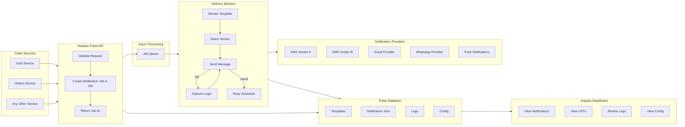

# Shadow Pulse Server

**Shadow Pulse** is a centralized, multi-channel notification platform designed to manage templates and deliver messages reliably across Email, SMS, Push, WhatsApp, and future channels.  
It features vendor failover, retries, configurable test modes, message logging, and an Angular-based dashboard for visibility.

# 🔥 Features

## ✅ Multi-Channel Delivery

Shadow Pulse supports multiple notification channels:

- **SMS** — OTPs, alerts
- **Email** — transactional & marketing
- **Push Notifications** — mobile/web push (future-ready)
- **WhatsApp** — templated and interactive messaging
- **Extensible** — easily add more (Slack, Teams, Webhooks, etc.)

## ✅ Template-Driven System

- Create and manage templates for each channel (email, SMS, push, WhatsApp).
- Fields include:
  - `templateId`
  - `channel`
  - `locale`
  - `subject` (email)
  - `body` (text/HTML/template syntax)
- Support for placeholder variables rendered at runtime.

## ✅ Reliable Delivery Pipeline

- Async job processing for high throughput.
- Automatic retries with exponential or linear backoff.
- Automatic **vendor failover**:
  - If Vendor A fails → retry with Vendor B.
  - Transactional notifications receive higher priority.

## ✅ Configurable “Safe Mode” for Dev/Test

- **notificationsEnabled = false**:
  - No messages sent.
  - All notifications stored in DB.
  - OTPs & rendered messages visible in dashboard.
- **Recipient whitelist**:
  - Only whitelisted emails/phone numbers receive real messages.
  - Others are stored but not delivered.

## ✅ Dashboard (Angular)

- View recent notifications & OTPs.
- Filter by template, channel, recipient, status.
- Inspect message body & variables.
- Review failures & retry logs.
- View runtime configuration (send mode, vendor status, etc.).

## ✅ Stateless API for Callers

Caller services provide:

- `templateId`
- `recipient` (email/phone/push token/WhatsApp ID)
- `data` (variables for rendering)
- Shadow Pulse manages everything else:
  - Choosing vendor
  - Template rendering
  - Logging
  - Retries
  - Sending

## ✅ Message Logging & Retention

- All notifications stored in DB.
- Automatic retention cleanup:
  - Keep e.g. 30–90 days in DB.
  - Older ones can be archived or deleted.

## ✅ Future Extensibility

Shadow Pulse is built to scale into:

- Multi-tenant notification routing
- Advanced decision engines (country-based routing, AB testing)
- Webhooks for delivery receipts

# 🏗 High-Level Architecture (Mermaid Diagram)



# 🗄 Data Model (Conceptual)

### **Templates**

- Key, channel, locale
- Body, subject (email)
- Sender profile
- Active flag

### **Notification Jobs**

- id, templateKey, channel
- recipient (email/phone/push/whatsapp)
- payloadJson
- renderedBody (dev/test)
- type (transactional/marketing)
- status (`pending`, `sent`, `failed`, `permanently_failed`)
- attempts, vendor used, timestamps

### **Logs**

- Attempt logs with vendor responses
- Failure reasons
- Retried timestamps

### **Config**

- notificationsEnabled
- whitelist
- retry settings
- vendor routing preferences

# 🚀 Delivery & Retry Logic

1. Create job in DB.
2. Process asynchronously in workers.
3. Render template with data.
4. Select vendor:
   - Use primary
   - Failover to secondary if needed

5. Update job status.
6. If failed:
   - Increment attempt count
   - Schedule next attempt

7. After max attempts:
   - Mark as `permanently_failed`

Transactional notifications are always processed first.

# 🧪 Development & Test Mode

When `notificationsEnabled = false`:

- No external messages are sent.
- Job is still logged in DB as if processed.
- Dashboard displays OTPs and rendered messages.
- Perfect for local/dev environments.

With whitelist enabled:

- Only specific recipients actually get messages.
- Others get stored (for dashboard viewing), not delivered.

# 🛠 Setup

### Backend

```
bun install
bun dev
```

### Frontend (Angular)

```
cd app
bun install
bun start
```

# 📅 Roadmap

- Authentication via **Accounts Service**
- Push notifications support (FCM, APNs)
- WhatsApp interactive templates
- Vendor heartbeat monitoring
- Rate limiting & throttling
- Per-tenant routing rules
- Webhook support for delivery receipts
- Advanced analytics dashboards

# 🖤 Summary

**Shadow Pulse** is a secure, scalable, multi-channel notification platform offering:

- Templates
- Multi-channel delivery (SMS, Email, Push, WhatsApp)
- Vendor failover
- Automatic retries
- Dev/test safe mode
- Dashboard for visibility
- Clean, async API

It decouples notification logic from application logic, simplifying your entire ecosystem.

If you want, I can also help you generate the initial folder structure or a starter code scaffold for both backend + Angular frontend.
